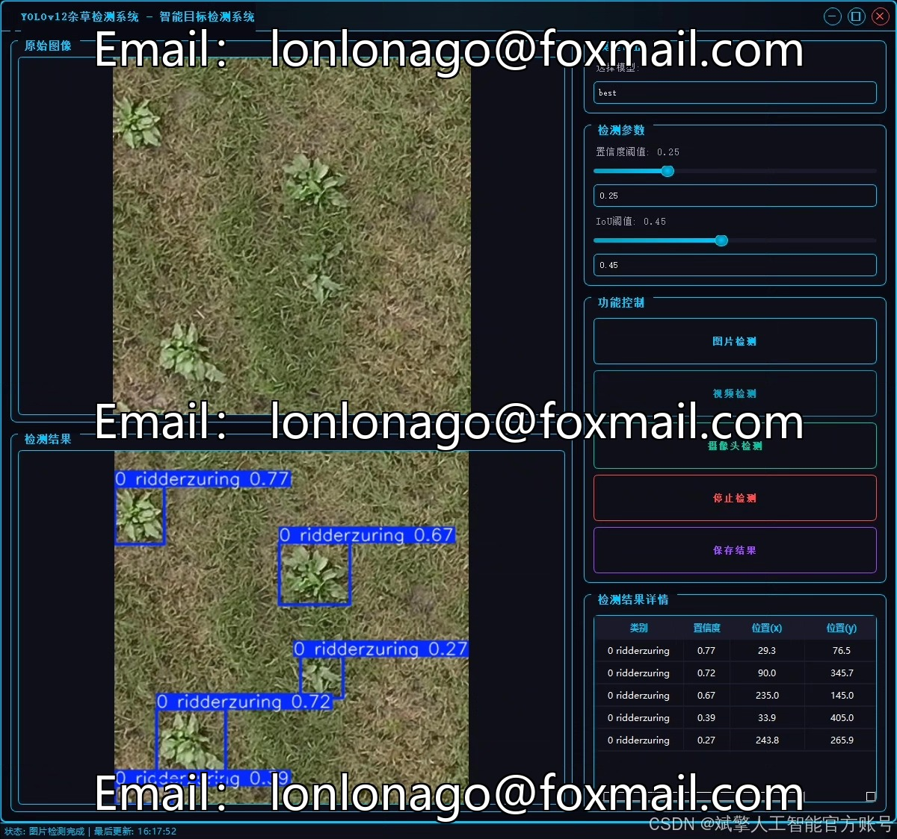
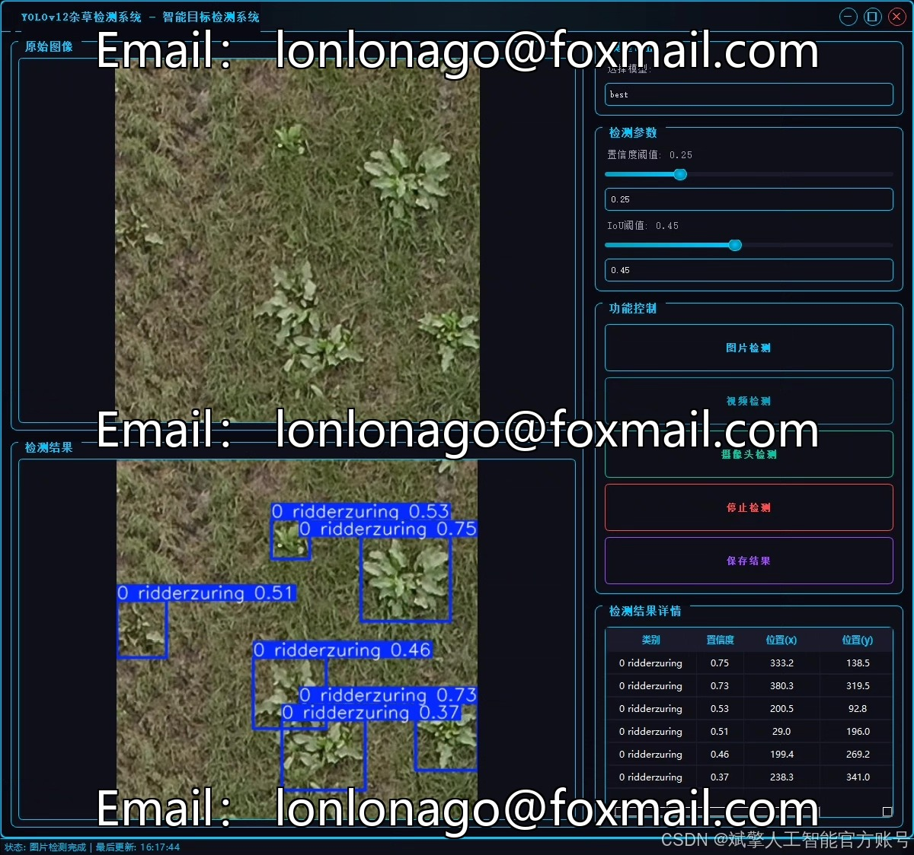
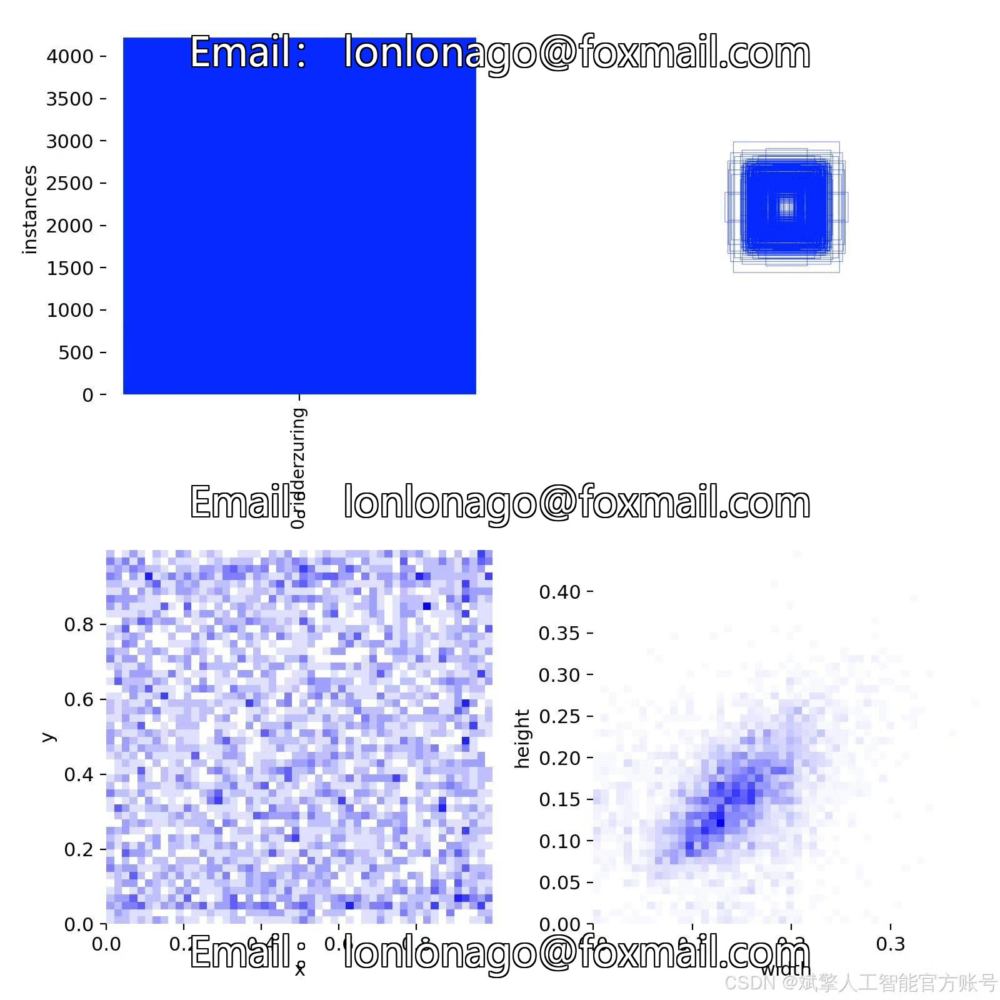
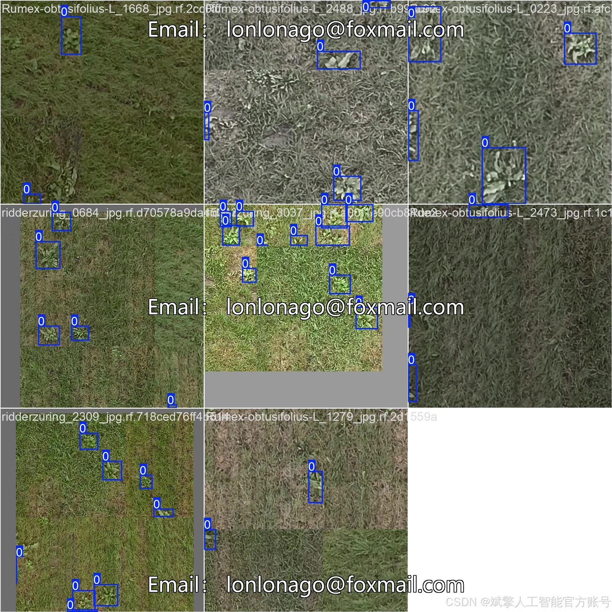
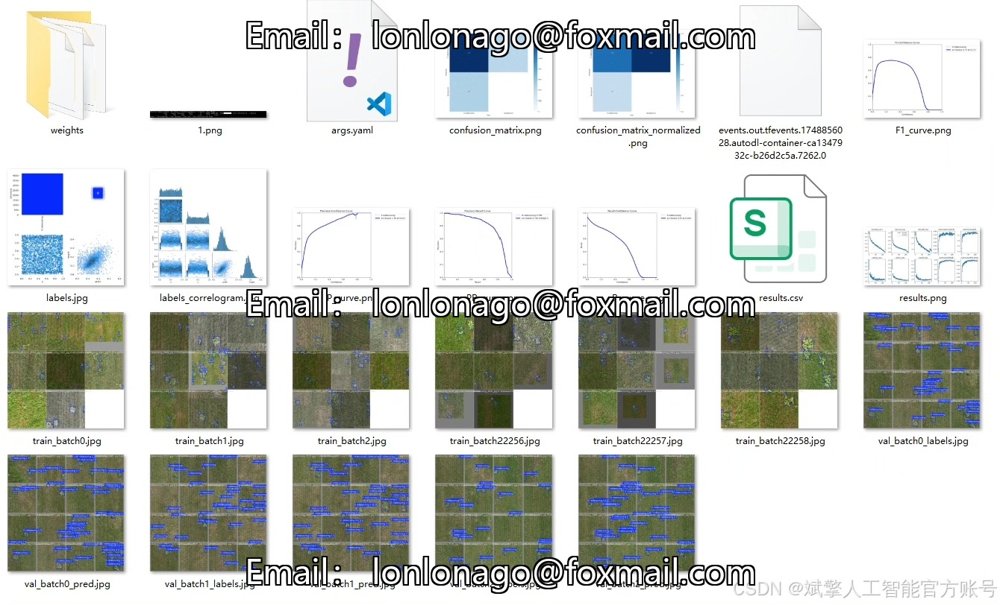
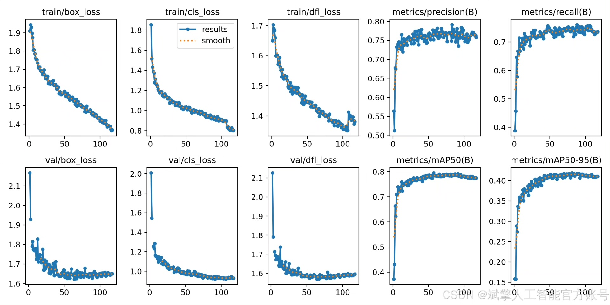
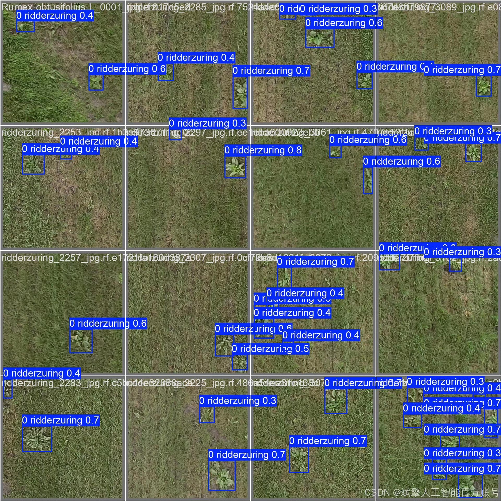

# Based on deep learning YOLOv12 for weed detection system (YOLOv12+Y)

## Body

Based on the latest YOLOv12 deep learning algorithm, this project has developed a weed detection system specifically targeting the problem of weed identification in agriculture. The system achieves efficient detection of specific weed species "ridderzuring" (Amaranthus caudatus).

Dataset:
nc: 1 class,
name: ['0 ridderzuring'],
dataset quantity: training set 1661, validation set 580, test set 245.

✅ User login and registration: Supports password verification and security validation.
✅ Three detection modes: Based on the YOLOv12 model, supports image, video, and real-time camera detection, accurately identifying targets.
✅ Dual-screen comparison: Displays the original scene and detection results on the same screen.
✅ Data visualization: Real-time table displaying the category, confidence, and coordinates of detected targets.
✅ Intelligent parameter adjustment: Offers a confidence slide bar to dynamically optimize detection accuracy, adapting to different scene requirements.
✅ Sci-fi style interface: Dark theme combined with dynamic light effects, reducing visual fatigue and enhancing operational experience.

## Images

## Payment

Here is a pay link on Stripe ( https://buy.stripe.com/3cs8yP7sY87d0vu9AB ). Please contact me lonlonago@foxmail.com after funding $89, and I will send you a complete data files , thank you!

